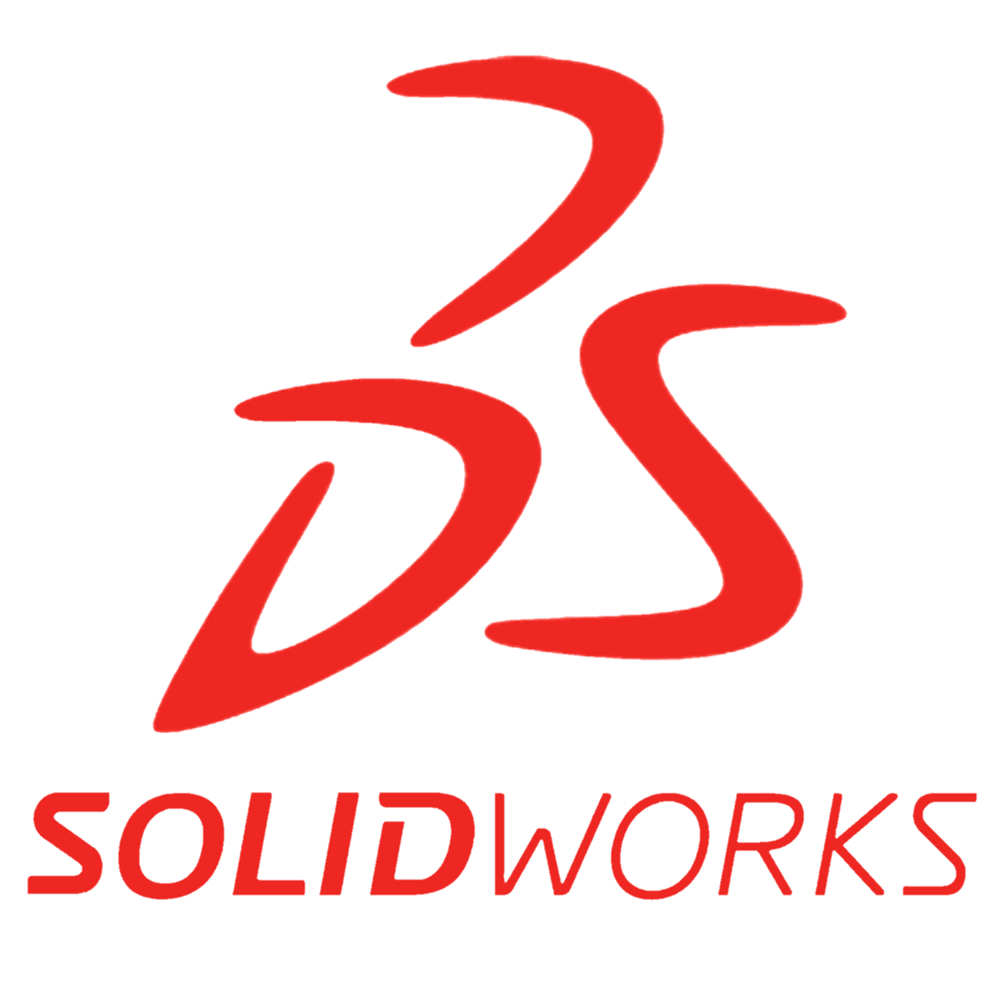

  

<h1 align="center">👋 Hi, I’m Victor</h1>

<h3 align="center">👀 A software engineering undergraduate in Singapore.</h3>

<h3 align="left">📫 How to reach me:</h3>

- Email: **victortan102@gmail.com**

<h3 align="left">🔗 Connect with me on Linkedin:</h3>

<h3 align="left">🧑🏻‍💻 Programming Languages: </h3>

    
    
    
    
    
    
    
  <a href="https://www.ni.com/en/shop/labview.html" target="_blank" rel="noreferrer">
    <picture>
      <source media="(prefers-color-scheme: dark)" srcset="./Icons/labview-original-wordmark-dark.svg" width="50" height="50">
      <source media="(prefers-color-scheme: light)" srcset="https://raw.githubusercontent.com/devicons/devicon/master/icons/labview/labview-original-wordmark.svg" width="50" height="50">
      
    </picture>
  </a>  

<h3 align="left">📝 Markup Languages: </h3>

  <a href="https://www.w3schools.com/css/" target="_blank" rel="noreferrer">
    <picture>
      <source media="(prefers-color-scheme: dark)" srcset="https://raw.githubusercontent.com/devicons/devicon/master/icons/css3/css3-plain-wordmark.svg" width="50" height="50">
      <source media="(prefers-color-scheme: light)" srcset="https://raw.githubusercontent.com/devicons/devicon/master/icons/css3/css3-original-wordmark.svg" width="50" height="50">
      
    </picture>
  </a>  
  <a href="https://www.w3schools.com/html/" target="_blank" rel="noreferrer">
    <picture>
      <source media="(prefers-color-scheme: dark)" srcset="https://raw.githubusercontent.com/devicons/devicon/master/icons/html5/html5-plain-wordmark.svg" width="50" height="50">
      <source media="(prefers-color-scheme: light)" srcset="https://raw.githubusercontent.com/devicons/devicon/master/icons/html5/html5-original-wordmark.svg" width="50" height="50">
      
    </picture>
  </a>  

<h3 align="left">🛢 Database Management Systems: </h3>

    
    

<h3 align="left">🧩 Frameworks and Platforms: </h3>

    
    
    
  <a href="https://libgdx.com/" target="_blank" rel="noreferrer">
    <picture>
      <source media="(prefers-color-scheme: dark)" srcset="./Icons/libGDX-dark.png" width="50" height="50">
      <source media="(prefers-color-scheme: light)" srcset="./Icons/libGDX-light.png" width="50" height="50">
      
    </picture>
  </a>  

<h3 align="left">🛠️ Software & Tools: </h3>

    
    
    
    
    
    
    
    
    
    
    
    

<h3 align="left">📈 GitHub Statistics: </h3>

  
  

